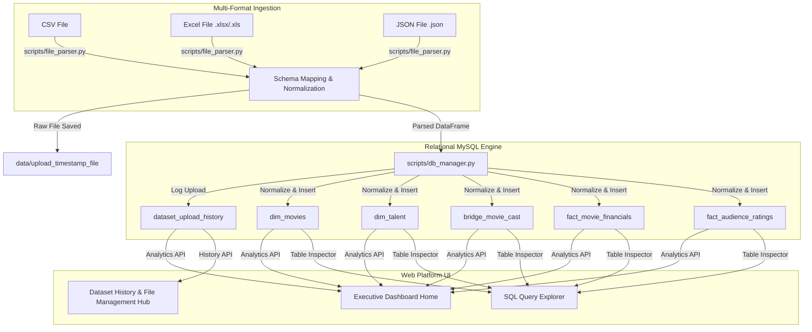
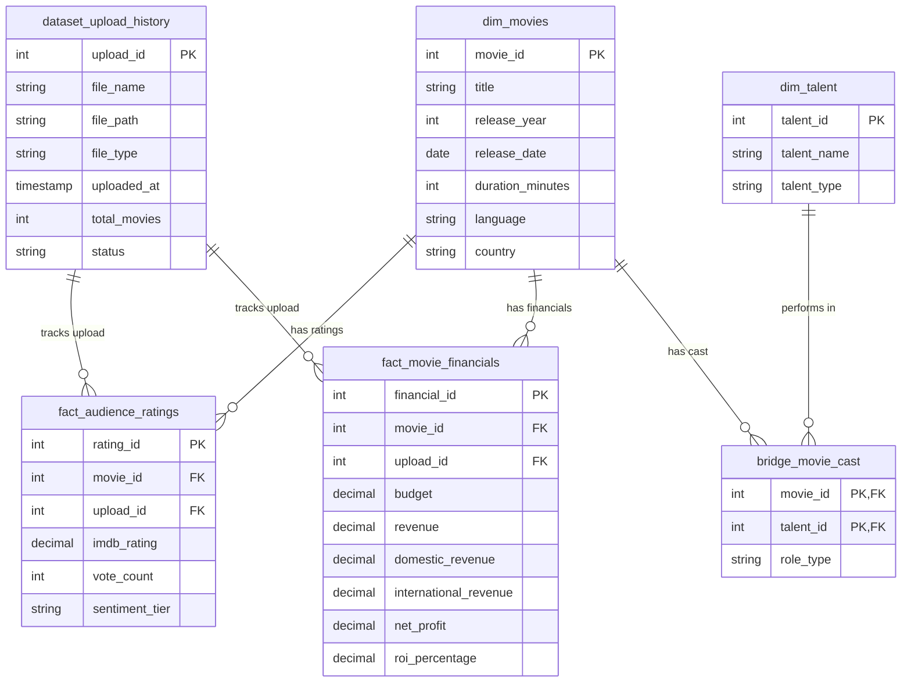

# CineScope SQL — Full-Stack Movie Analytics Platform


---

## 🎬 Project Overview & Core System Goal

**CineScope SQL** is an interactive, end-to-end MySQL-backed analytics platform designed for streaming platforms (e.g., Netflix, Amazon Prime Video) and production houses.

### Key Upgraded System Capabilities:
1. **Interactive Dashboard Home**: Primary landing screen featuring KPI summary metrics, financial ROI charts, territory split breakdown, talent box-office yields, and movie profitability tier distributions.
2. **Multi-Format Dataset Ingestion**: Drag-and-drop or upload new movie datasets in **CSV, Excel (`.xlsx` / `.xls`), or JSON** formats.
3. **Relational Data Normalization**: Parsed datasets are sanitized, normalized, and populated into relational schema tables (`dim_movies`, `dim_talent`, `bridge_movie_cast`, `fact_movie_financials`, `fact_audience_ratings`).
4. **Dataset Upload History & Management Hub**: Lists all previously uploaded datasets (upload timestamps, total rows, file format, status) with one-click dataset selection to re-run/trigger analytics on specific uploads.
5. **Persistent Navigation**: Quick navigation bar with a **"Back to Home / Dashboard"** button across all screens.
6. **SQL Query & Table Explorer**: Live interactive inspector for all database tables.

---

## 🏗️ System Architecture



---

## 🗄️ Relational Database Schema (ERD)



---

## 🚀 Quickstart & Execution Guide

### 1. Install Dependencies
```bash
pip install -r requirements.txt
```

### 2. Launch the Web Analytics Platform
Run the platform server:
```bash
python app.py
```
Open your browser at: **`http://localhost:8500`**

---

## 📁 Repository Directory Layout

```text
CineScope-SQL-Movie-Analytics/
├── app.py                             # Full-Stack Platform Application & HTTP Server
├── scripts/
│   ├── db_manager.py                  # MySQL / Fallback engine, DB auto-creation & queries
│   ├── file_parser.py                 # Multi-format uploader parser (CSV, Excel, JSON)
│   └── data_loader.py                 # CLI Ingestion script
├── data/
│   ├── sample_movies_raw.csv          # Sample raw CSV file
│   ├── sample_movies.xlsx             # Sample raw Excel file
│   └── sample_movies.json             # Sample raw JSON file
├── database/
│   ├── 01_create_database.sql         # Core DDL schema
│   └── 02_insert_sample_data.sql      # Core sample data SQL script
├── sql/                               # Modular analytical SQL scripts (01 to 05)
├── dashboard/
│   └── dax_measures_and_model.md      # Power BI Star Schema & DAX calculation specs
├── documentation/
│   └── analytics_guide.md             # Technical analytics logic reference
├── requirements.txt                   # Dependency manifest
└── README.md                          # Main project documentation
```
