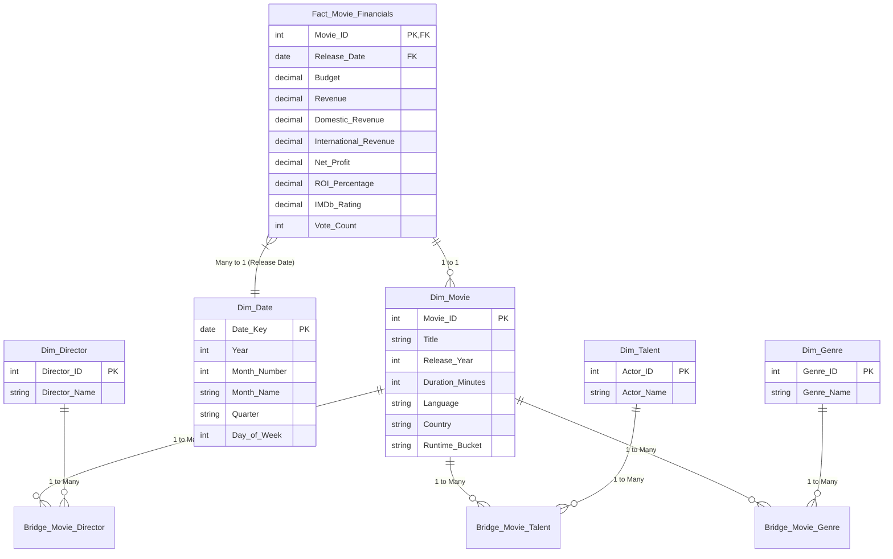

# Power BI Data Model Architecture & DAX Calculation Suite

## Executive Summary
This document defines the enterprise Star Schema data model architecture, exact DAX measure definitions, and page-by-page visual layout wireframes for the **CineScope Executive Movie Analytics & Risk Management Dashboard**.

---

## 1. Data Model Architecture (Star Schema)

### Entity-Relationship Architecture Diagram



### Table Definitions & Relationships

| Source Table / View | Model Table Name | Role | Primary Key | Foreign Key / Relationship | Filter Direction |
| :--- | :--- | :--- | :--- | :--- | :--- |
| `movies` | `Fact_Movie_Financials` | Fact | `Movie_ID` | `Release_Date` -> `Dim_Date[Date_Key]` | Single (Dim -> Fact) |
| `movies` | `Dim_Movie` | Dimension | `Movie_ID` | `Movie_ID` -> `Fact_Movie_Financials[Movie_ID]` | Single (1:1) |
| `directors` | `Dim_Director` | Dimension | `Director_ID` | Via `Bridge_Movie_Director` | Both / Bi-directional |
| `actors` | `Dim_Talent` | Dimension | `Actor_ID` | Via `Bridge_Movie_Talent` | Both / Bi-directional |
| `genres` | `Dim_Genre` | Dimension | `Genre_ID` | Via `Bridge_Movie_Genre` | Both / Bi-directional |
| Dynamic Calendar | `Dim_Date` | Date Dimension | `Date_Key` | `Date_Key` -> `Fact_Movie_Financials[Release_Date]` | Single (1:Many) |

---

## 2. Comprehensive DAX Measure Suite

All DAX formulas adhere to enterprise BI standards: utilizing explicit `DIVIDE()` for safe zero-division, `CALCULATE()` with `KEEPFILTERS()` for context preservation, and standard time intelligence functions.

### Core Financial DAX Measures

#### 1. Total Budget
```dax
Total Budget = 
SUM ( Fact_Movie_Financials[Budget] )
```

#### 2. Total Global Revenue
```dax
Total Global Revenue = 
SUM ( Fact_Movie_Financials[Revenue] )
```

#### 3. Total Domestic Revenue
```dax
Total Domestic Revenue = 
SUM ( Fact_Movie_Financials[Domestic_Revenue] )
```

#### 4. Total International Revenue
```dax
Total International Revenue = 
SUM ( Fact_Movie_Financials[International_Revenue] )
```

#### 5. Total Net Profit
```dax
Total Net Profit = 
[Total Global Revenue] - [Total Budget]
```

#### 6. ROI % (Return on Investment)
```dax
ROI % = 
DIVIDE (
    [Total Net Profit],
    [Total Budget],
    0
)
```

#### 7. Profit Margin %
```dax
Profit Margin % = 
DIVIDE (
    [Total Net Profit],
    [Total Global Revenue],
    0
)
```

---

### Time-Intelligence & Growth DAX Measures

#### 8. Prior Year Revenue (PY Revenue)
```dax
PY Revenue = 
CALCULATE (
    [Total Global Revenue],
    SAMEPERIODLASTYEAR ( 'Dim_Date'[Date_Key] )
)
```

#### 9. YoY Revenue Growth %
```dax
YoY Revenue Growth % = 
VAR CurrentRevenue = [Total Global Revenue]
VAR PriorRevenue = [PY Revenue]
RETURN
DIVIDE (
    CurrentRevenue - PriorRevenue,
    PriorRevenue,
    0
)
```

#### 10. Cumulative Global Revenue
```dax
Cumulative Global Revenue = 
CALCULATE (
    [Total Global Revenue],
    FILTER (
        ALLSELECTED ( 'Dim_Date' ),
        'Dim_Date'[Date_Key] <= MAX ( 'Dim_Date'[Date_Key] )
    )
)
```

---

### Talent, Director & Segment DAX Measures

#### 11. Top 5 Directors by Revenue
```dax
Top 5 Directors by Revenue = 
CALCULATE (
    [Total Global Revenue],
    KEEPFILTERS (
        TOPN (
            5,
            ALL ( Dim_Director[Director_Name] ),
            [Total Global Revenue],
            DESC
        )
    )
)
```

#### 12. Talent Hit Rate %
```dax
Talent Hit Rate % = 
VAR TotalProjects = COUNTROWS ( Fact_Movie_Financials )
VAR HitProjects = 
    CALCULATE (
        COUNTROWS ( Fact_Movie_Financials ),
        KEEPFILTERS ( Fact_Movie_Financials[ROI_Percentage] >= 1.0 )
    )
RETURN
DIVIDE ( HitProjects, TotalProjects, 0 )
```

#### 13. Dynamic Rating Tier Indicator
```dax
Dynamic Rating Tier Indicator = 
VAR AvgRating = AVERAGE ( Fact_Movie_Financials[IMDb_Rating] )
RETURN
SWITCH (
    TRUE (),
    ISBLANK ( AvgRating ), "N/A",
    AvgRating >= 8.5, "⭐ Masterpiece (8.5+)",
    AvgRating >= 8.0, "🟢 Highly Acclaimed (8.0-8.4)",
    AvgRating >= 7.0, "🟡 Positive (7.0-7.9)",
    "🔴 Mixed/Low (<7.0)"
)
```

#### 14. Profitability Classification Tag
```dax
Profitability Tier Tag = 
VAR CurrentROI = [ROI %]
RETURN
SWITCH (
    TRUE (),
    CurrentROI >= 4.0, "🏆 Blockbuster (4x+ ROI)",
    CurrentROI >= 1.0, "📈 Profitable (1x-4x ROI)",
    CurrentROI >= 0.0, "⚖️ Broke Even (0x-1x ROI)",
    "📉 Box Office Flop (<0x ROI)"
)
```

---

## 3. Power BI Dashboard Layout Specification (3 Pages)

### Page 1: Executive Overview & KPI Summary Cards
**Objective**: Provide c-suite executives with quick visibility into overall portfolio health, top revenue drivers, and YoY trends.

- **Header Bar**: Global Slicers (Release Year Range, Country, Language).
- **Top Summary Cards**:
  1. Total Portfolio Revenue (`[Total Global Revenue]`) with YoY % badge (`[YoY Revenue Growth %]`).
  2. Total Net Profit (`[Total Net Profit]`).
  3. Overall Portfolio ROI % (`[ROI %]`).
  4. Average IMDb Rating (`[Dynamic Rating Tier Indicator]`).
- **Visual Layout**:
  - **Top Left (Line & Clustered Column Chart)**: Yearly Budget vs. Revenue with YoY Growth % line.
  - **Top Right (Donut Chart)**: Domestic vs. International Revenue split.
  - **Bottom Left (Bar Chart)**: Top 10 Movies by Net Profit.
  - **Bottom Right (Matrix / Table)**: Profitability Tier summary table (`Profitability Tier Tag`, Movie Count, Budget, Revenue, ROI %).

---

### Page 2: Talent & Director ROI Performance Matrix
**Objective**: Evaluate director and actor box-office contracts, historical averages, and hit-rate consistency.

- **Header Bar**: Director Slicer, Lead Actor Slicer, Minimum Projects Filter.
- **Top Visual**:
  - **Scatter Plot**: Director & Actor Performance Matrix.
    - X-Axis: Average Budget per Film.
    - Y-Axis: Average Global Revenue per Film.
    - Bubble Size: `[Talent Hit Rate %]`.
    - Tooltip: Director/Actor Name, Total Projects, Average IMDb Rating.
- **Bottom Left Visual (Column Chart)**: Top 5 Directors by Revenue (`[Top 5 Directors by Revenue]`).
- **Bottom Right Visual (Interactive Table)**:
  - Columns: Actor Name, Director Name, Total Projects, Total Box Office Gross, Average ROI %, Hit Rate %, Consistency Status.

---

### Page 3: Genre, Runtime & Audience Sentiment Deep-Dive
**Objective**: Analyze target runtime sweet spots, genre profitability, and audience rating correlations.

- **Header Bar**: Genre Multi-Select Slicer, Runtime Bucket Slicer.
- **Top Visual (Waterfall Chart)**: Revenue Breakdown by Genre (`Dim_Genre[Genre_Name]`).
- **Middle Visual (Clustered Column Chart)**: Runtime Bucket Analysis (`<90m`, `90-120m`, `120-150m`, `150m+`).
  - Bars: Average Global Revenue and Average Budget.
  - Line: Average IMDb Rating.
- **Bottom Visual (Heatmap / Matrix)**: Genre vs. Audience Sentiment Tier (`Dynamic Rating Tier Indicator`).
  - Values: Average ROI % and Movie Count color-coded by performance intensity.
